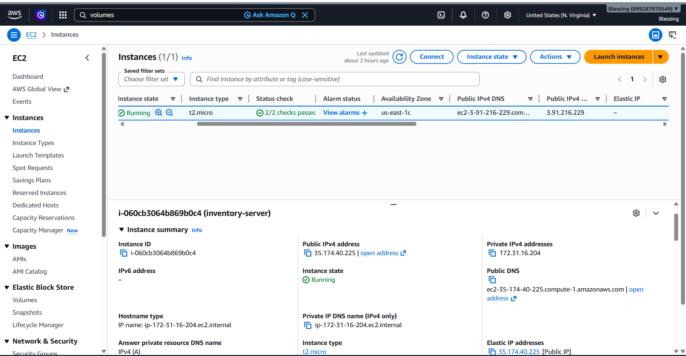
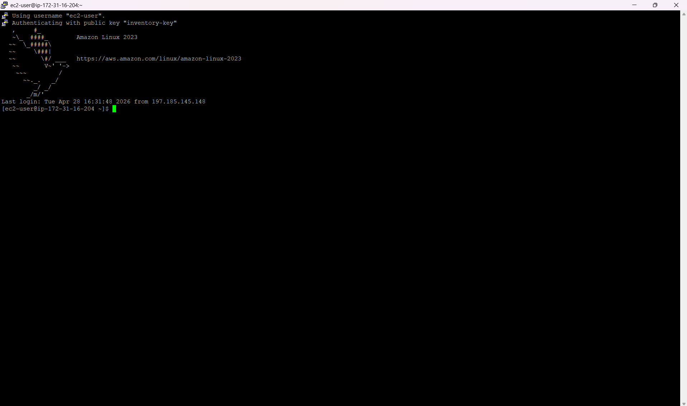
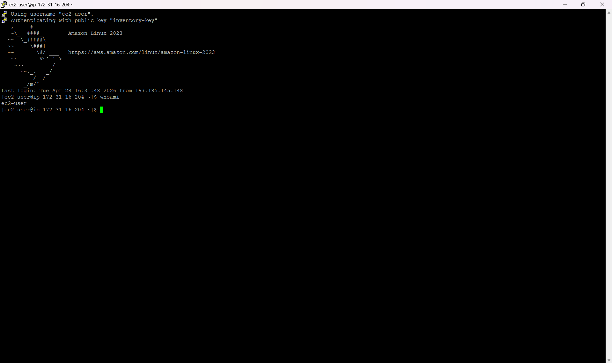
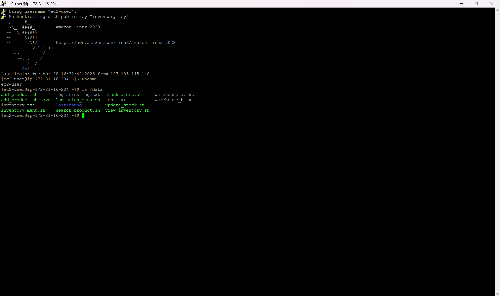
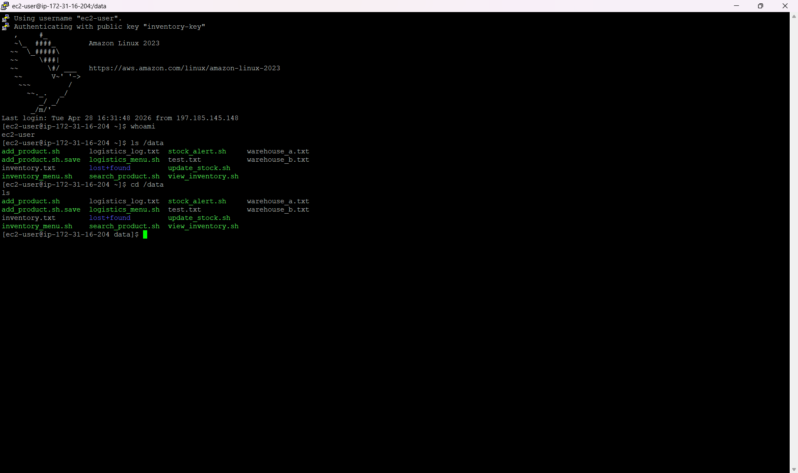
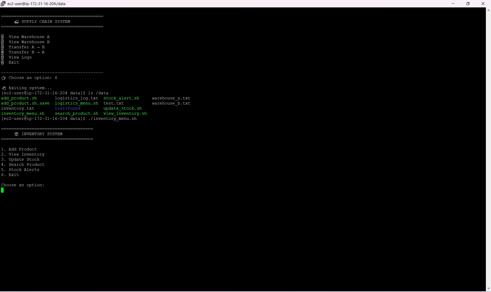

# AWS Supply Chain & Inventory Management System

A cloud-based Supply Chain and Inventory Management System built on AWS EC2. This project simulates real-world logistics operations, including inventory tracking, warehouse management, stock transfers, and audit logging.

---

## About This Project

This system was built to demonstrate practical cloud engineering skills, infrastructure setup, Linux administration, Bash scripting, and system design, all running on a live AWS EC2 instance.

**Candidate:** Blessing Rakoma
**Role Target:** Cloud Engineer
**LinkedIn:** [linkedin.com/in/blessingrakoma](https://www.linkedin.com/in/blessingrakoma)

---

## Cloud Architecture

**Platform:** AWS

| Component | Purpose |
|-----------|---------|
| Amazon EC2 (t2.micro) | Hosts the application |
| Amazon EBS | Persistent storage for all system data |
| Amazon Linux 2023 | Operating system |
| Bash Scripting | Core application logic |

**Storage structure on EC2:**

```
/data
├── inventory.txt
├── warehouse_a.txt
├── warehouse_b.txt
├── logistics_log.txt
├── inventory_menu.sh
└── logistics_menu.sh
```

---

## System Features

### Inventory Management System (`inventory_menu.sh`)

- Add new products
- View inventory
- Update stock quantities
- Search for products
- Low-stock alert system
- Menu-driven CLI interface

### Supply Chain System (`logistics_menu.sh`)

- Multi-warehouse support (Warehouse A & B)
- Stock transfer between warehouses
- Real-time inventory movement simulation
- Bidirectional transfer (A → B and B → A)
- CLI-based logistics interface

### Audit Logging System

Every stock transfer is automatically logged to `logistics_log.txt`, including:
- Timestamp
- Transfer direction
- Product details

**Example log entry:**
```
2026-04-30 | TRANSFER | A → B | 1,Laptop,10
```

---

## How It Works

1. User connects to EC2 via SSH (PuTTY)
2. Navigates to `/data` directory
3. Runs either:
   - `./inventory_menu.sh` for inventory operations
   - `./logistics_menu.sh` for supply chain operations
4. System processes user input via Bash scripts
5. Data is stored and updated in text files (persistent via EBS)
6. Transfers are logged automatically

---

## Screenshots

| # | Screenshot | Description |
|---|-----------|-------------|
| 1 |  | EC2 instance running in AWS Console |
| 2 |  | SSH connection via PuTTY |
| 3 |  | EC2 user identity verified |
| 4 |  | /data directory with all project files |
| 5 |  | Navigating into /data |
| 6 |  | Both CLI menus running live |

---

## Skills Demonstrated

**Cloud & Infrastructure**
- AWS EC2 provisioning and management
- Elastic IP allocation and usage
- Persistent storage with EBS

**Linux & Scripting**
- Bash scripting for automation
- File manipulation and parsing
- CLI application development

**System Design**
- Modular architecture (separate systems)
- File-based data management
- Menu-driven user interface

**DevOps Concepts**
- Logging and monitoring (audit trail)
- Data persistence
- Environment setup and troubleshooting

---

## Challenges & Solutions

**Challenge:** Maintaining data consistency across multiple warehouse files

**Solution:** Implemented controlled transfer logic using Bash (grep, mv, temp files)

---

**Challenge:** Debugging script errors and syntax issues

**Solution:** Used incremental testing and Bash debugging techniques

---

## Future Improvements

- Replace text files with a database (RDS or DynamoDB)
- Build a web interface (React + API backend)
- Add authentication and user roles
- Implement automated backups and disaster recovery
- Deploy using Infrastructure as Code (Terraform or CloudFormation)

---

## Project Outcome

This project demonstrates the ability to:
- Build and deploy systems on AWS
- Design backend logic using scripting
- Simulate real-world business processes
- Apply DevOps and cloud engineering principles

---
